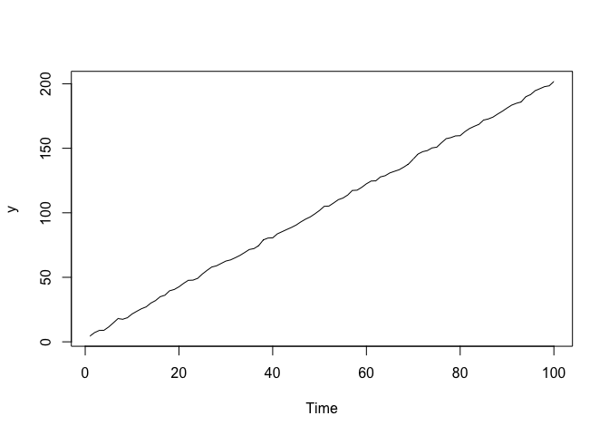
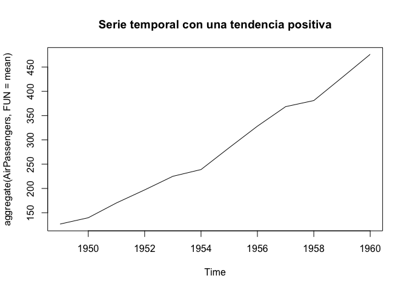
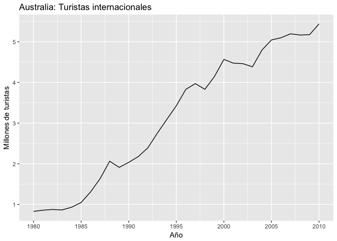

Series temporales
================

Una serie temporal se define como una colección de observaciones de una variable recogidas secuencialmente en el tiempo.

Ejemplos de series temporales
-----------------------------

-   Índices del tipo de interés
-   Inflacción interanual en España
-   Evolución del número de visitas a un sitio web
-   Habitantes de un país
-   Tasa de natalidad
-   Evolución niveles de CO2 en Madrid

Tipos de series temporales
--------------------------

Una serie temporal puede ser **discreta** o **continua** dependiendo de cómo sean las observaciones.

Series son **determinísticas**: se pueden predecir exactamente los valores, se dice que las series son **determinísticas**.

Series son **estocásticas**: el futuro sólo se puede determinar de modo parcial por las observaciones pasadas y no se pueden determinar exactamente, se considera que los futuros valores tienen una **distribución de probabilidad** que está condicionada a los valores pasados.

Objetivos del análisis de series temporales
-------------------------------------------

El principal objetivo es el de elaborar un modelo estadístico que describa la procencia de dicha serie.

-   Descriptivos: La dibujamos y consideramos sus medidas descriptivas básicas. ¿Presentan una tendencia?. ¿Existe estacionalidad?. ¿Hay valores extremos?

-   Predictivos: En ocasiones no sólo se trata de explicar los sucedido sino de ser capaces de predecir el futuro.

Estudio descriptivo
-------------------

Se basa en descomponer una serie temporal en una serie de componentes

-   Tendencia: Movimiento suave de la serie a largo plazo

``` r
data(AirPassengers)
plot(aggregate(AirPassengers,FUN=mean), main="Serie temporal con una tendencia positiva")
```



-   Estacionalidad: Variaciones cada cierto periodo de tiempo (semanal, mensual, etc.). Esta estacionalidad se puede eliminar de la serie temporal para facilitarnos su análisis.

``` r
plot(AirPassengers, main="Serie temporal con una clara estacionalidad")
```



-   Componente aleatoria o ruido (random noise): Son los movimientos de la serie que quedan tras eliminar los demás componenentes. El objetivo es estudiar si existe algún modelo probabilístico que logre explicar este tipo de flutuaciones.

``` r
set.seed(1)
plot(rnorm(100),type="l", main = "Serie temporal aleatoria")
```


> Las dos primeras componentes son determinísticas y la última es estocástica o aletaria.

Al final, una serie temporal *X*<sub>*t*</sub> se define como:

*X*<sub>*t*</sub> = *T*<sub>*t*</sub> + *E*<sub>*t*</sub> + *I*<sub>*t*</sub>

------------------------------------------------------------------------

Dentro de cualquier análisis descriptivo, es básico dibujar la serie.

-   Valores en el eje Y
-   Tiempo en el eje X

A continuación debemos comprobar si la serie es **estacionaria o no estacionaria**.

-   Serie estacionaria: Son series estables. Su media y su varianza son constantes a lo largo del tiempo.

-   Serie no estacionaria: Son inestables, con media y varianza cambiantes a lo largo del tiempo.

> Existen métodos para transformar series no estacionarias en estacionarias.

``` r
set.seed(42)
y<- w<- rnorm(1000)
for (t in 2:1000) {
    y[t]<- 0.9*y[t-1]+w[t]
    }
xy.mat<- cbind(c(0,450,225,750,600,1000),c(6.5,6.5,7.5,7.5,8.5,8.5))
##Plot the series, with annotations for means and the Dicky-Fuller Test##
plot(1:length(y),y,xlab="t",ylab=expression(y[t]),type="l",ylim=c(-8,10),main="Serie temporal estacionaria")
points(xy.mat,pch=20,col="blue",cex=0.75)
for(i in c(1,3,5)) {segments(x0=xy.mat[i,1],y0=xy.mat[i,2],x1=xy.mat[i+1],lty=3,col="blue",lwd=2)}
text(125,7,labels=expression(E(y[t])==-0.220))
text(350,8,labels=expression(E(y[t])==-0.376))
text(725,9,labels=expression(E(y[t])==-0.341))
text(125,-6.5,labels=expression(ADF == -6.128));
```



La serie es estable alrededor de un valor central y la distribución bastante simétrica

``` r
hist(y, main = "Histograma de la serie estacionaria")
```


``` r
set.seed(42)
yns<- wns<- rnorm(1000)
for (t in 3:1000) {
    yns[t]<-1.5*yns[t-1]-0.5*yns[t-2]+wns[t]
    }
plot(1:length(yns),yns,xlab="t",ylab=expression(y[t]),type="l",ylim=c(-100,20),main="Serie temporal no estacionaria")
xyns.mat<- cbind(c(0,450,225,750,600,1000),c(10,10,0,0,-10,-10))
points(xyns.mat,pch=20,col="blue",cex=0.75)
for(i in c(1,3,5)) {segments(x0=xyns.mat[i,1],y0=xyns.mat[i,2],x1=xyns.mat[i+1],lty=3,col="blue",lwd=2)}
text(125,14,labels=expression(E(y[t])==-13.27))
text(350,4,labels=expression(E(y[t])==-27.56))
text(725,-6,labels=expression(E(y[t])==-64.51))
text(125,-60,labels=expression(ADF == -2.0251));
```


``` r
hist(yns, main = "Histograma de una serie no estacionaria", breaks = 10)
```


